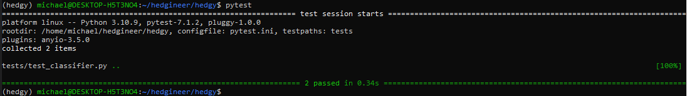

# Hedgy

Hedgy is an AI framework designed to give investors access to the best technology and AI systems to make better risk adjusted returns. Building on powerful LLMs we integrate 
best in class processes and APIs into a single AI framework so that your AI knows how to use the technology and data for you. 


## Examples of things you might ask Hedgy:
- What are the biggest risk factors in my portfolio?
- Can you help me understand why EV/EBIDTA is diverging between GM and FORD?
- What alternative data do you have on Johnson Controls supply chain dependencies in South America? How accurate does it explain their inventory backups?
- Have there been any corporate access events that I missed over last 6 months that were important?
- Let me know if there are any S1 filings relevant to my coverage space.


## How It Works?
Hedgy uses standardized API documentation to create prompts that instruct the AI how to route user requests to the corect API AND how to call the API directly. The hedgy code base acts as an orchestration layer between the User -> AI -> API. This enables the AI to use factual data when generating results and allows the AI to leverage the intenal tools in ways that a human may not be able to or not have the time.

We rely on human curation of the correct APIs to use and the best way to use technology in a research process and allow the AI to bridge the gap between a user and what tools need to be used. These APIs are initially located in the `/src/hedgy/api/` directory with additional meta data stored in the `__init__.py` file. 

## Installation

To install Hedgineer, you need to have Python 3.6 or above installed on your system. You can install Hedgineer using pip by running the following command:

```python
conda create -f conda_env.yaml
```

## Tests

Use Pytests to make sure everything is installed correctly:

```python
conda activate hedgy
pytest
```



## Features (Generic AI Generated )

- Easy-to-use interface for building and testing trading bots
- Powerful backtesting engine for simulating trading strategies
- Real-time market data and order execution
- Supports multiple exchanges and trading pairs
- Built-in risk management tools and portfolio optimization
- Advanced order types and trading indicators
- Cloud-based platform for easy deployment and management

## Getting Started (Generic AI Generated )

To get started with Hedgineer, simply sign up for an account on our website. Once you've created your account, you can start building and testing your trading bots using our intuitive interface. You can also connect your exchange accounts and start trading in real-time.

## Documentation (Generic AI Generated )

For more information on how to use Hedgineer, please refer to our comprehensive documentation. Our documentation includes detailed guides, tutorials, and API reference documentation.
...

## Podcast & Videos

We are regularly discussing AI and Technology for hedge funds at https://hedgineer.io. You can also find us below:

- Youtube: https://www.youtube.com/channel/UCbulCxi0-MPPw5mHLLlN0Pg
- Slack: https://hedgineer.slack.com/
- Spotify: https://open.spotify.com/show/0Aq6pxd...
- Apple Podcast: https://podcasts.apple.com/us/podcast...
- Instagram: https://www.instagram.com/hedgineer/
- Twitter: https://twitter.com/hedgineering
- LinkedIn: https://www.linkedin.com/company/hedg...
- TikTok: https://www.tiktok.com/@hedgineer

## Community

Join us in the [Hedgineer Slack](https://join.slack.com/t/hedgineer/shared_invite/zt-1qr0xgzts-40TSggK_nee1gnxH7UfyQA) Community.

## Support

If you have any questions head over to Slack, please contact us at info@hedgineer.com.

## License (Generic AI Generated )

Hedgineer is licensed under the ![Business Source License 1.1(LICENSE.md)] © 2023 MariaDB plc